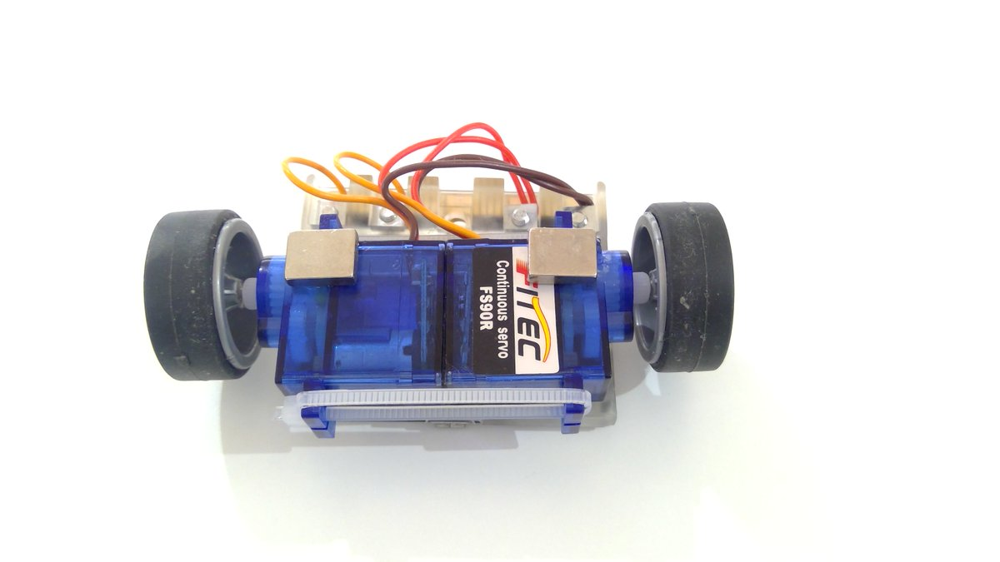

# Robotica Móvil

 by @javacasm

### José Antonio Vacas

El objetivo del curso es desarrollar los conocimientos de programación y robótica utilizando como medio robots móviles

# Índice

## Adaptación a 
* C++ con Arduino y ESP
* mbot y mblock  
* Bloques en micro:bit
* python en micro:bit y ESP

# Modelo inicial: SimpleBot
Robot con 2 servos de rotación continua

(basado en el modelo de [@google_homer](https://twitter.com/google_homer_) [aquí](https://twitter.com/google_homer_/status/1178613025651089409))

* Estructura del chasis
* Baterías/pilas
* Modelos

## Movimientos básicos
* Funciones de movimiento
* Líneas
* Giros. Distintas geometrías de giro

## Geometría y tipos de robots
* Trazando 
* Formas
* Trayectoria recta: correcciones
* Distancias
* Dibujando
* Maniobra:	Aparcamiento

## Sensores
### Sensor de suelo  
* Tipos y donde ponerlos. 
* Sensor digital
	* Calibración
	* Seguir línea. 
	* Ajustes. Mejoras
	* Maniobra:  No te caigas
* Sensor analógico: grises y colores. 
	* Entrenamiento de colores
	* Sensor de color
	* Maniobra: Instrucciones pintadas
	
### Sensores de distancia  
* Tipos/ ventajas     
* Ultrasonido     
* Infrarrojos
* Maniobras:
	* Esquivar obstáculos  
	* Sígueme

## Modelos comerciales
* mbot
* maQueen
* robot motores TT
* ELegoo smartcar

## Control remoto
* Radio
* Bluetooth
* Infrarrojos
* Wifi

## Control de motores
* Tipos  
* Precisión vs velocidad
* Encoders: Interrupciones
* Sensores inerciales  
	* Planificando movimientos  
	* Correcciones

## Pruebas 
* Laberintos  
* Mapas 
* Velocistas  
	* PID